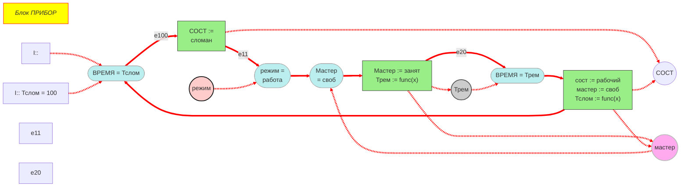
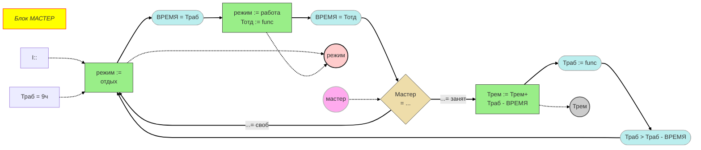
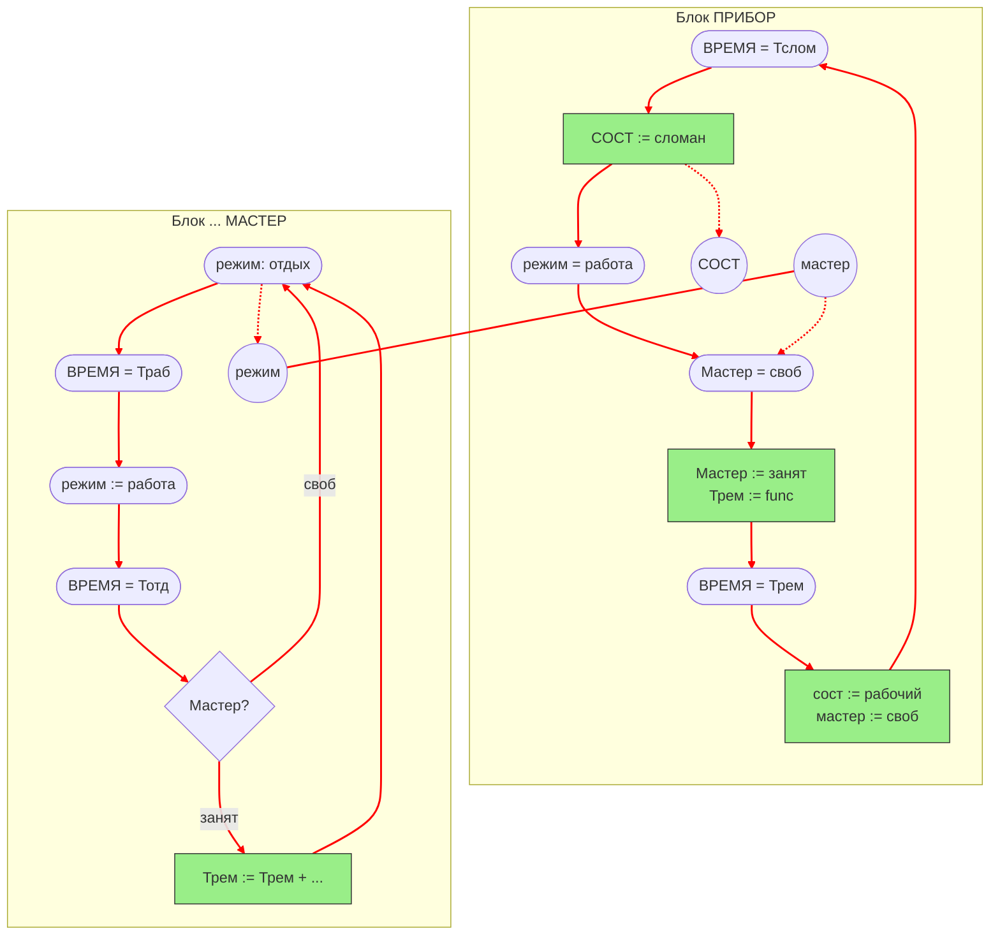

# Отчет по семинару: Операторно-параметрические схемы имитационной модели

**Студент:** [Громов Владислав / ИУ5-63Б]  
**Тема:** Отрисовка ОПС модели процесса ремонта «Прибор-Мастер» в Mermaid

---

## 1. Трек 1 — Блок «ПРИБОР»

Операторно-параметрическая схема функционирования прибора, фиксирующая моменты поломки, занятость мастера и параметры состояния.

## 2. Трек 2 — Блок «МАСТЕР»

## 3. Объединенная ОПС модели ремонта «Прибор-Мастер»

