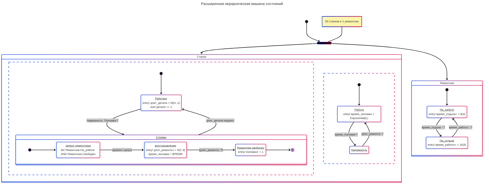

# Семинар: Расширенная Иерархическая Машина Состояний

**Выполнил:** [Громов Владислав / ИУ5-63Б]

## 1. Модель «Станок и ремонтник»
Описание работы станка и ремонтника (50 станков, 1 ремонтник). Включает в себя вложенные состояния поломки и параллельные процессы надежности.



## 2. Модель «Складское обслуживание»

```mermaid
---
title: Модель «Складское обслуживание»
config:
  theme: neo
---
stateDiagram-v2
    direction TB

    [*] --> Складская_Система

    state Складская_Система {
        
        %% === ПОДПРОЦЕСС 1: СКЛАД ===
        state Склад {
            [*] --> Рабочие_Дни
            Рабочие_Дни --> Пятница_Инвентаризация: Конец недели (Пятница)
            Пятница_Инвентаризация --> Выходные: Инвентаризация завершена
            Выходные --> Рабочие_Дни: Понедельник

            Рабочие_Дни: <u>Обслуживание спроса</u><br>do/ Списание товара (40-63 шт/день)<br>Текущий_уровень -= Спрос
            Выходные: <u>Склад закрыт</u><br>Длительность = 2 дня
            
            state Пятница_Инвентаризация {
                state if_order <<choice>>
                
                [*] --> Проверка_Остатка
                Проверка_Остатка --> if_order
                if_order --> Без_Заказа: Если Остаток >= 600
                if_order --> Формирование_Заказа: Если Остаток < 600
                Без_Заказа --> [*]
                Формирование_Заказа --> [*]: Сигнал "Сделать_Заказ"<br>Объем = 1000 - Остаток
            }
        }

        --

        %% === ПОДПРОЦЕСС 2: ЛОГИСТИКА ===
        state Логистика {
            [*] --> Ожидание_Запроса
            Ожидание_Запроса --> Доставка_В_Пути: Получен сигнал "Сделать_Заказ"
            Доставка_В_Пути --> Пополнение_Склада: Прошло 5 рабочих дней
            Пополнение_Склада --> Ожидание_Запроса: Остаток += Объем_Заказа

            Ожидание_Запроса: <u>Нет активных заказов</u>
            Доставка_В_Пути: <u>Транспортировка</u><br>duration/ 5 рабочих дней
            Пополнение_Склада: <u>Оприходование товара</u>
        }
    }
```